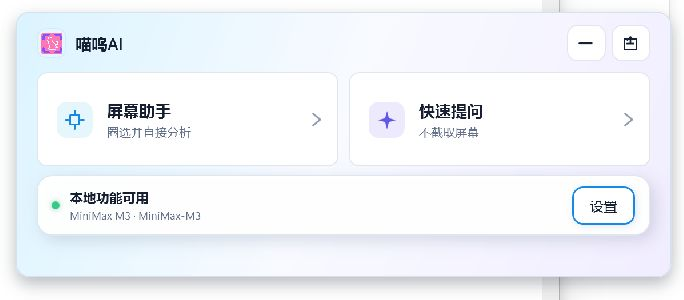
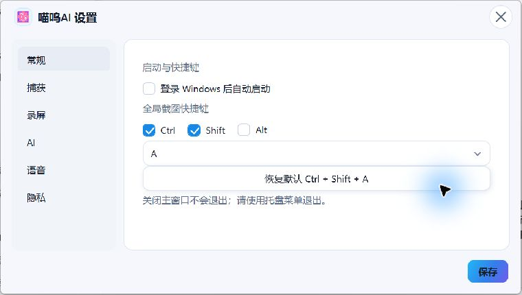
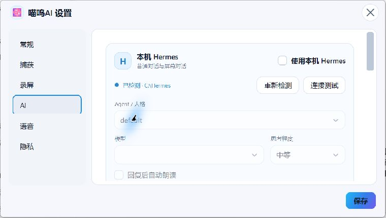

<div align="center">
  

  # MewuAI · 喵呜AI

  **A native Windows screen assistant that keeps capture, annotation, OCR, recording, and AI in one continuous canvas.**

  [简体中文](./README.zh-CN.md) · **English** · [Download](https://github.com/abnste/mewu_ai/releases/latest) · [Report a bug](https://github.com/abnste/mewu_ai/issues)

  [](https://github.com/abnste/mewu_ai/releases/tag/v0.0.1)
  [](#system-requirements)
  [](https://dotnet.microsoft.com/)
  [](#architecture)

  [**Download installer**](https://github.com/abnste/mewu_ai/releases/download/v0.0.1/MewuAI-Setup-0.0.1-win-x64.exe) · [Portable ZIP](https://github.com/abnste/mewu_ai/releases/download/v0.0.1/MewuAI-Portable-0.0.1-win-x64.zip)
</div>

<br />

<div align="center">
  
</div>

## Why MewuAI?

Most screenshot tools stop after producing an image, while most AI clients pull that image into a separate chat window. MewuAI keeps the whole workflow in place: select one or more regions, annotate them, record motion, ask a question, inspect streamed reasoning, and jump back to AI-marked video moments without leaving the frozen desktop context.

> [!IMPORTANT]
> Capture, pinning, annotation, copy, save, local OCR, and region recording work without an API key. Screen content is sent only after you explicitly invoke AI or translation.

## Highlights

| | Capability | What it gives you |
|---:|---|---|
| ✂️ | **Multi-region capture** | Re-select, move, resize, number, reference, undo, and redo multiple regions across mixed-DPI monitors. |
| ✍️ | **In-place annotation** | Pen, highlighter, rectangle, ellipse, arrow, text, localized system fonts, numbered markers, RGB colors, and export with or without annotations. |
| 👁️ | **Offline OCR** | Bundled PP-OCRv6 Small multilingual models with continuous cross-line text selection; Windows OCR is used only as an error fallback. |
| 🎬 | **Region video** | Three-second interactive countdown, MP4 recording, pause/resume, in-place preview, on-demand GIF export, and video-aware AI questions. |
| 🎯 | **Video timeline annotations** | AI answers can seek to a marked frame or play a tracked action range. Compact action chips take you back to every relevant moment. |
| 🤖 | **Provider freedom** | MiniMax M3 by default plus OpenAI-compatible endpoints, custom models, headers, image/video input, streaming reasoning, and local history. |
| 🐚 | **Local Hermes** | Detect a local Hermes installation and keep profile/agent, model, reasoning level, session, attachments, and TTS bound together. |
| 🔊 | **Voice** | Desktop SAPI speech input and optional Hermes-powered automatic read-aloud. |
| 🔐 | **Privacy by design** | Capture-protected product windows, explicit-send boundary, DPAPI-protected credentials, scrubbed buffers, and sanitized logs. |

## One canvas, from capture to answer

MewuAI does not open a detached result window. The bottom composer expands in place only when an answer arrives; screen regions remain mapped to their original coordinates, and AI annotations return to the exact image or video object that produced them.

| Native settings | Local Hermes integration |
|:---:|:---:|
|  |  |

## Download and install

### Installer — recommended

Download [`MewuAI-Setup-0.0.1-win-x64.exe`](https://github.com/abnste/mewu_ai/releases/download/v0.0.1/MewuAI-Setup-0.0.1-win-x64.exe). It installs per user, adds a Start Menu shortcut, optionally creates a desktop shortcut, and includes an uninstaller.

### Portable

Download [`MewuAI-Portable-0.0.1-win-x64.zip`](https://github.com/abnste/mewu_ai/releases/download/v0.0.1/MewuAI-Portable-0.0.1-win-x64.zip), extract it, and run `MewuAI.exe`. The package is self-contained; no separate .NET installation is required.

On first launch MewuAI stays in the system tray. Press <kbd>Ctrl</kbd> + <kbd>Shift</kbd> + <kbd>A</kbd> to open the screen assistant.

### System requirements

- Windows 10 version 2004 / build 19041 or newer, x64.
- Windows N/KN editions need the Microsoft Media Feature Pack for H.264 recording and preview.
- AI features need a compatible provider or a local Hermes installation; local capture tools do not.

> [!NOTE]
> Version `0.0.1` is an early public build. The installer is not Authenticode-signed yet, so Windows SmartScreen may display an unknown-publisher notice. Verify the SHA-256 values published in the release notes.

## Privacy and data flow

```text
Frozen desktop ──► local selection / drawing / OCR / recording
                         │
                         └── explicit Send / Translate ──► selected Provider or local Hermes
```

- API keys and sensitive custom headers are encrypted with Windows DPAPI for the current user.
- Generated image buffers are cleared after provider requests, including cancellation and failure paths.
- Conversation context is bounded; incomplete turns and late streaming fragments are rejected.
- Logs do not intentionally contain API keys, authorization headers, Base64 media, screenshots, recordings, or full prompts.
- Temporary media is lease-managed so an active preview, export, or clipboard operation cannot be cleaned out from under the user.

## Architecture

MewuAI is Windows-only by design and stays on modern C#, WPF, and .NET. Coordinate conversion is centralized around physical virtual-desktop pixels for per-monitor DPI correctness. Capture/presentation, AI providers, local Hermes, OCR, and recording are isolated behind services.

- **UI:** .NET 10 WPF, PerMonitorV2, native DWM corners/shadows where applicable.
- **Capture & recording:** Windows Graphics Capture / Desktop Duplication through ScreenRecorderLib; H.264 via Windows Media Foundation.
- **OCR:** RapidOcrNet + bundled PP-OCRv6 Small ONNX models; Windows OCR fallback on initialization/inference errors only.
- **Rich answers:** Markdig FlowDocument rendering and color emoji through Emoji.Wpf.
- **No FFmpeg, no GPL/AGPL dependencies.**

## Build from source

Requirements: Windows x64 and the .NET 10 SDK.

```powershell
dotnet build .\mewu_ai_Assistant.csproj -c Release -p:Platform=x64
dotnet test .\tests\MewuAI.Tests\MewuAI.Tests.csproj -c Release -p:Platform=x64
dotnet publish .\mewu_ai_Assistant.csproj -c Release -p:Platform=x64 -r win-x64 --self-contained true -o .\artifacts\release\win-x64
```

The publish target rejects PDBs, non-Windows native assets, settings, credentials, logs, screenshots, recordings, and QA files. Third-party notices and runtime/model licenses are included in every distribution.

## Project status

The current build focuses on a stable Windows capture-to-AI loop. Feedback and reproducible bug reports are welcome in [GitHub Issues](https://github.com/abnste/mewu_ai/issues).

---

<div align="center">
  Built for fast, private, in-place screen understanding on Windows.
</div>
