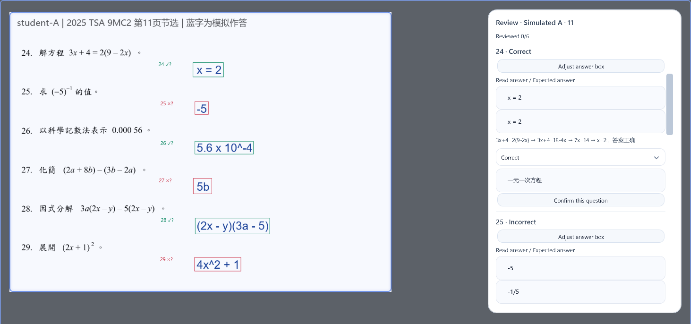

  
  <h1>MewuAI</h1>
  
A Windows screenshot tool with screen recording, pinned images, text recognition, and AI annotations.

  

    
    
    
  

  

    <a href="https://github.com/abnste/mewu_ai/releases/download/v0.4.0/MewuAI-Setup-0.4.0-win-x64.exe"><strong>Download installer</strong></a>
    &nbsp;·&nbsp;
    <a href="https://github.com/abnste/mewu_ai/releases/download/v0.4.0/MewuAI-Portable-0.4.0-win-x64.zip">Portable ZIP</a>
  

  
<a href="./README.zh-CN.md">简体中文</a> · <strong>English</strong> · <a href="./CHANGELOG.md">Changelog</a> · <a href="https://github.com/abnste/mewu_ai/issues">Report an issue</a>

Select something on your screen and ask AI to translate it, explain it, or highlight the important parts. Answers and annotations appear alongside the content, and you can save them with your screenshot.

  

## Features

- **Papers and assignments:** Import selected PDF pages or collect screenshots across capture sessions. Review per-page grading, compare shared errors across submissions, and edit/export separate practice questions and answers. Teacher confirmation remains required. [Workflow guide](./docs/teaching-workflow.md).

- **Screenshots and scrolling capture:** Select a region or window, capture across monitors, and scroll up or down to capture long pages.
- **Annotations and pinned images:** Add pen strokes, highlights, arrows, shapes, text, numbered markers, and pixelation. Drag annotations to adjust them, or pin a screenshot on your desktop for reference.
- **Text and tables:** Copy text from images, translate screenshots, and use AI to extract tables for Excel.
- **Screen recording:** Record a region with computer audio and an optional microphone. Export MP4 video, MP3 audio, or a GIF.
- **Ask about images and videos:** Reference several screenshots or attachments, ask follow-up questions, and click a time in an answer to jump to the relevant video scene.
- **Choose your AI:** Connect API services, Hermes, ChatGPT Work / Codex, WorkBuddy, or MiniMax Code. Switch between them and keep your last selection.

Screenshots, manual annotations, pinned images, text recognition, and recording work without an AI account. Translation, table extraction, and AI questions require a connected service.

## Preview

<table>
<tr>
<td width="50%" valign="top">
<h3>Highlight details</h3>

Ask AI to circle items, add checkmarks, or leave notes on a screenshot. Continue with follow-up questions.

</td>
<td width="50%" valign="top">
<h3>Translate screenshots</h3>

Read translations where the original text appears, then select text to copy it.

</td>
</tr>
<tr>
<td width="50%" valign="top">
<h3>Understand code</h3>

Select a piece of code and ask for an explanation tied to the lines you are reading.

</td>
<td width="50%" valign="top">
<h3>Draw and annotate</h3>

Ask AI to add a diagram, or add your own notes with pens, shapes, and text.

</td>
</tr>
</table>

### Paper grading

See correct, incorrect and uncertain answers marked on the original page. Review the reading, expected answer and verdict, or adjust an answer box. Collect several submissions to build practice from their reviewed shared errors. [Explore the teaching workflow](./docs/teaching-workflow.md).

  

*Source: [HKEAA 2025 TSA Secondary 3 Mathematics 9MC2, page 11](https://www.bca.hkeaa.edu.hk/web/Common/res/2025secPaper/S3Math/TSA2025_9MC2_Q.pdf#page=11). The original exam layout is preserved. Blue answers are simulated; annotations and verdicts are from the recorded MiniMax evaluation and still require teacher review. Exam copyright belongs to its original owner.*

### Video analysis

Record a short demonstration or attach an existing video, then ask a question. Time buttons in the answer take you to the relevant scene. Annotations can follow the subject while a marked segment plays.

  

## Get started

1. **Install and open.** Download the installer above, or extract the portable ZIP and run MewuAI.exe. Requires Windows 10 2004 or later, x64. No separate .NET installation is needed.
2. **Capture a region.** Press <kbd>Shift</kbd> + <kbd>Alt</kbd> + <kbd>S</kbd>, drag to select an area, and use the toolbar to copy, save, annotate, extract text, or record.
3. **Connect AI.** Set up and save a connection in **Settings → AI**. Use the capture toolbar's reference button to add a region to your question. You can also upload attachments or ask a text-only question.

**Settings → General** lets you change the capture shortcut and switch between English and Simplified Chinese. Press Delete in the shortcut field to disable it. Restart the app after changing its language.

## AI connections

| Connection | What you need |
| --- | --- |
| API | Your provider's API key and a model. Supports OpenAI-compatible services, MiniMax, and Volcengine, with multiple saved endpoints. |
| Hermes | A configured Hermes installation on your PC. Choose a profile and model in settings. |
| ChatGPT Work / Codex | A signed-in ChatGPT Work / Codex installation on your PC. Choose a model and reasoning level in settings. |
| WorkBuddy | Install and sign in to WorkBuddy desktop, then connect and choose a model in settings. |
| MiniMax Code | Sign in to MiniMax Code desktop. You can open it from settings; no separate command-line installation is required. |

With multiple connections saved, click the **model button after Upload** in the conversation bar to choose one. Your configurations are kept, and the app remembers your last selection.

Image and video support depends on the selected model. MiniMax M3 is available through API or Hermes. Codex and WorkBuddy may need video-processing tools already installed on your PC to inspect videos. Check AI answers and annotations against the original content.

## FAQ

Does it cost anything?

Screenshots, annotations, pinned images, text recognition, and recording are available without an AI account. AI features use the account or API you connect; your provider determines charges and usage limits.

Why are my selections and annotations missing from a screen share?

Teaching mode is on by default. Share your entire screen in your meeting or classroom app. You can turn it off or back on under **Settings → Capture → Teaching mode**; save and start a new capture to apply the change.

This makes selections, annotations, and newly pinned images and videos visible to viewers. You can also use MewuAI's recording and scrolling capture while teaching mode is on. Controls stay outside the capture area; when there is no room, such as a full-screen capture, they are hidden. Press **F8** to stop recording or finish scrolling capture. During the recording countdown, F8 cancels it.

Are screenshots and conversations uploaded automatically?

Screenshots, manual annotations, and text recognition are processed on your PC. When you use AI analysis, translation, or another AI feature, the relevant content is sent to your chosen service. Text-only questions do not automatically include your desktop.

API keys are stored encrypted on your PC. A connected desktop AI app may also use cloud services.

How do I update? What if an older version cannot update?

Opening Settings checks for updates automatically. You can also check manually in **Settings → About**.

If you use v0.2.5 or earlier, download the installer from this page to upgrade manually. See the [changelog](./CHANGELOG.md) for previous versions and their release notes.

The release page shows a SHA-256 digest in each asset's details for verifying the installer and portable ZIP. A separate checksum file is not provided.

Having trouble installing or recording?

The installer is not code-signed yet, so Windows may show an unknown-publisher prompt. Download from this repository's [Releases](https://github.com/abnste/mewu_ai/releases); the asset details include its SHA-256 checksum.

Windows N / KN editions need the Media Feature Pack to record and play video. For other problems, [open an issue](https://github.com/abnste/mewu_ai/issues) with your app version, Windows version, and steps to reproduce it.

## Contributing

Bug reports, suggestions, code, and documentation improvements are welcome. See the [contributing guide](./CONTRIBUTING.md) for development setup and build instructions, the [code of conduct](./CODE_OF_CONDUCT.md) for community guidelines, and the [security policy](./SECURITY.md) for vulnerability reports.

## License

Created by **Abner Stephen** & **Yandi**.

Project-owned source is licensed under [MPL-2.0](./LICENSE). Commercial use is permitted under the license. When distributing covered software, provide the covered source and retain copyright and license notices as required. See [license and source information](./SOURCE.md) and the separate [third-party notices](./THIRD-PARTY-NOTICES.md).
