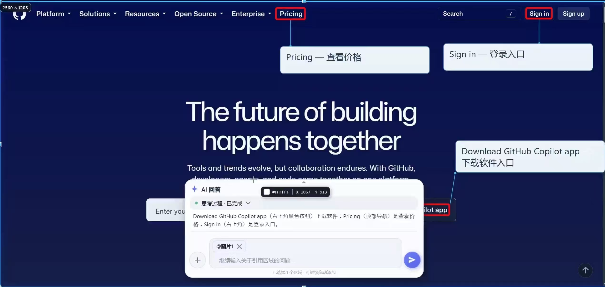
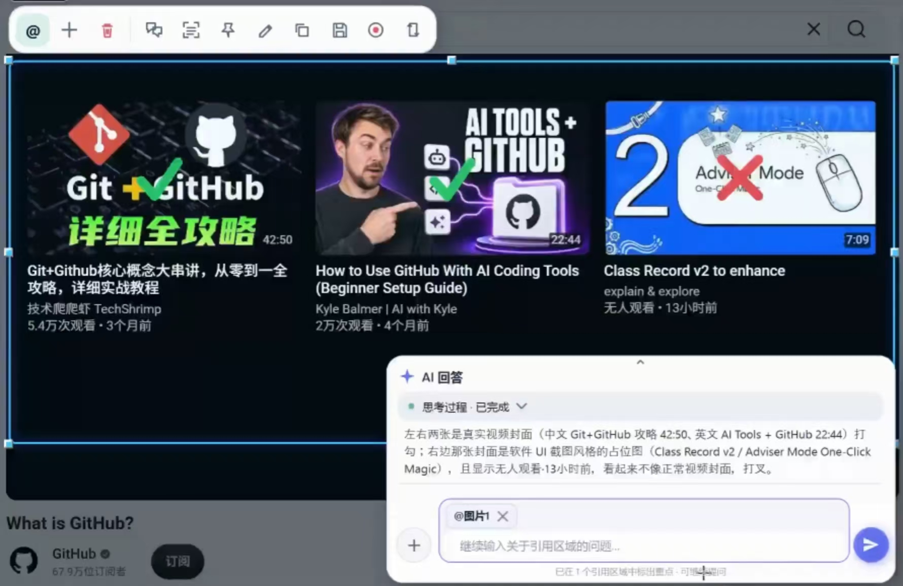
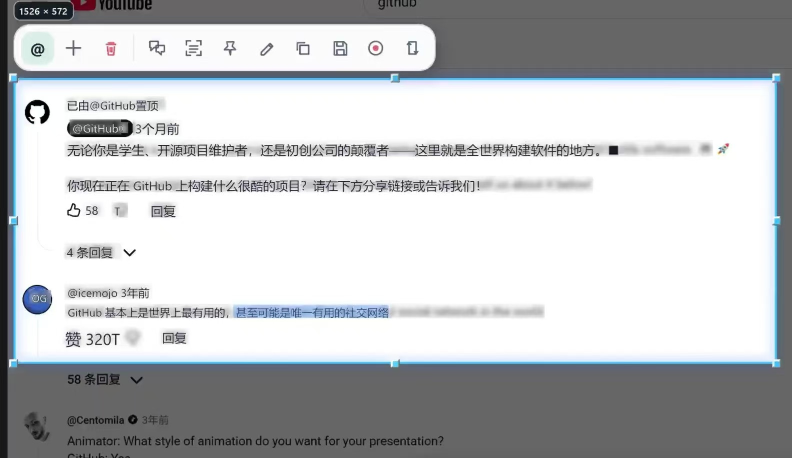
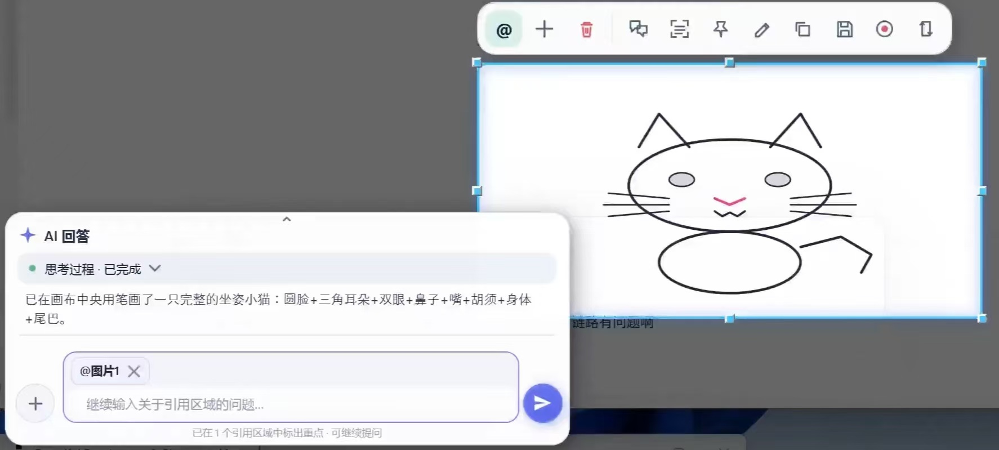

<div align="center">
  
  <h1>喵呜AI · MewuAI</h1>
  <p><strong>截下画面，让 AI 直接在眼前标注、翻译、讲解。</strong></p>
  <p>Windows 截图与原位 AI 助手</p>
  <p><strong>简体中文</strong> · <a href="./README.md">English</a> · <a href="#功能实景">功能实景</a> · <a href="https://github.com/abnste/mewu_ai/issues">反馈建议</a></p>
  <p>
    <a href="https://github.com/abnste/mewu_ai/releases/tag/v0.2.3"></a>
    
    
  </p>
  <p><a href="https://github.com/abnste/mewu_ai/releases/download/v0.2.3/MewuAI-Setup-0.2.3-win-x64.exe"><strong>下载安装版</strong></a> &nbsp; · &nbsp; <a href="https://github.com/abnste/mewu_ai/releases/download/v0.2.3/MewuAI-Portable-0.2.3-win-x64.zip">免安装 ZIP</a></p>
</div>

<p align="center">
  <a href="./docs/images/web-annotations.jpg"></a>
  <br /><sub>答案不只在对话里，也在你正在看的画面上。</sub>
</p>

## 功能实景

<table>
<tr>
<td width="50%" valign="top">
<h3>圈重点，打勾打叉</h3>
<p>让 AI 圈出细节、添加说明；继续追问时保留已有标注。</p>
<a href="./docs/images/ai-checkmarks.jpg"></a>
</td>
<td width="50%" valign="top">
<h3>原位翻译，选字复制</h3>
<p>译文融入原画面，支持选中复制；离线 OCR 也能直接提取截图文字。</p>
<a href="./docs/images/in-place-translation.jpg"></a>
</td>
</tr>
<tr>
<td width="50%" valign="top">
<h3>对着内容讲清楚</h3>
<p>把解释连到对应的代码、图示或界面；用 @ 引用多张截图与附件。</p>
<a href="./docs/images/code-explanation.jpg"></a>
</td>
<td width="50%" valign="top">
<h3>让 AI 动笔，也能自己画</h3>
<p>AI 绘图与手工画笔、形状、文字、序号、高亮和马赛克。</p>
<a href="./docs/images/ai-drawing.jpg"></a>
</td>
</tr>
</table>

### 视频标注，跟着画面走

录制区域或添加视频，跳到 AI 标记的时刻，播放指定片段并跟踪标注。

<p align="center">
  
  <br /><sub>自动循环演示 · <a href="https://github.com/abnste/mewu_ai/releases/download/v0.2.3/MewuAI-video-annotations.mp4">查看有声 MP4</a></sub>
</p>

*实景素材由作者提供。AI 回答、标注位置与时间可能有误，使用前请核对。*

在腾讯会议、极域等软件中演示框选和标注时，请开启 **设置 → 捕获 → 教学演示模式**，保存后重新截图，并在会议软件中共享整个屏幕。新建贴图、贴视频也会显示，设置页仍受保护。教学录像可使用会议软件；喵呜AI自带区域录屏和长截图需要关闭此模式。

## 截图工具，该有的都有

- **截图与长截图：** 多屏框选、窗口与受支持控件吸附、上下双向滚动拼接。
- **贴图与编辑：** 置顶、缩放、旋转，移动标注、撤销修改，保存原件或带标注图片。
- **文字与表格：** 离线 OCR、AI 表格识别；表格可粘贴到 Excel，也可复制为 Markdown 或图片。
- **录屏与取色：** 区域录屏、MP4 / GIF 导出，鼠标位置颜色值与屏幕坐标。

> 截图、贴图、手工标注、OCR 和录屏无需 AI 账号。AI 对话、翻译与表格识别需要配置具备相应能力的后端。

**已测试模型：** MiniMax M3 已通过 Hermes 和 API 两种接入渠道测试。其他模型尚未验证，请自行测试兼容性。

## 三步开始

1. **安装或解压。** 下载上方安装版，或解压 ZIP 后运行 `MewuAI.exe`，无需另装 .NET。
2. **框选内容。** 按 <kbd>Shift</kbd> + <kbd>Alt</kbd> + <kbd>S</kbd>，通过选区工具条复制、保存、置顶、标注或识别。
3. **按需接入 AI。** 在设置中配置兼容 API，或连接本机 Hermes；用 `@` 引用内容后提问。

应用与安装程序跟随 Windows 语言；**设置 → 常规** 可切换简体中文 / English（重启生效）或修改快捷键。**设置 → 关于** 可检查更新。

<details>
<summary>系统要求与安装提示</summary>

Windows 10 2004（build 19041）及以上，x64。Windows N/KN 录制和播放 H.264 需要 Media Feature Pack。安装包暂未代码签名，SmartScreen 可能提示未知发布者；请从本仓库 Releases 下载，并核对附带的 `SHA256SUMS.txt`。

</details>

<details>
<summary>AI 接入与隐私</summary>

- 图片、视频能力取决于所选模型；连接本机 Hermes 也可能使用云端模型服务。
- 提供商可选 OpenAI 通用、MiniMax、MiniMax (CN)、火山引擎；只有 OpenAI 通用需要填写 URL，其余使用固定地址。填写 Key 后选择模型，请求参数按需在高级设置中修改。
- 主动调用 AI 功能时才发送相应内容；纯文字提问不会自动附带桌面截图。服务商的数据政策适用于已发送内容。
- API Key 与敏感认证 Header 使用 Windows DPAPI 本地加密。未配置可用对话后端时，隐藏 AI 对话条与引用入口，离线工具仍可使用。

</details>

<details>
<summary>在 Windows x64 上构建与测试</summary>

安装 .NET 10 SDK，在仓库根目录运行：

```powershell
dotnet restore .\mewu_ai_Assistant.slnx --locked-mode
dotnet test .\tests\MewuAI.Tests\MewuAI.Tests.csproj -c Release -p:Platform=x64 --no-restore
dotnet restore .\mewu_ai_Assistant.csproj --locked-mode -r win-x64 -p:Configuration=Release -p:Platform=x64 -p:SelfContained=true
dotnet publish .\mewu_ai_Assistant.csproj -c Release -p:Platform=x64 -r win-x64 --self-contained true --no-restore -o .\artifacts\release\win-x64
```

[发布流程](./.github/workflows/release.yml) 还会编译连通性测试项目、审计发布目录，并生成安装 EXE 与免安装 ZIP。

</details>

---

<p align="center">
  作者 <strong>Abner Stephen</strong><br />
  源代码公开 · 商业使用需作者授权<br />
  <a href="./THIRD-PARTY-NOTICES.md">第三方声明</a> · <a href="https://github.com/abnste/mewu_ai/issues">反馈与建议</a> · <a href="https://github.com/abnste/mewu_ai/releases/tag/v0.2.3">更新记录</a>
</p>
