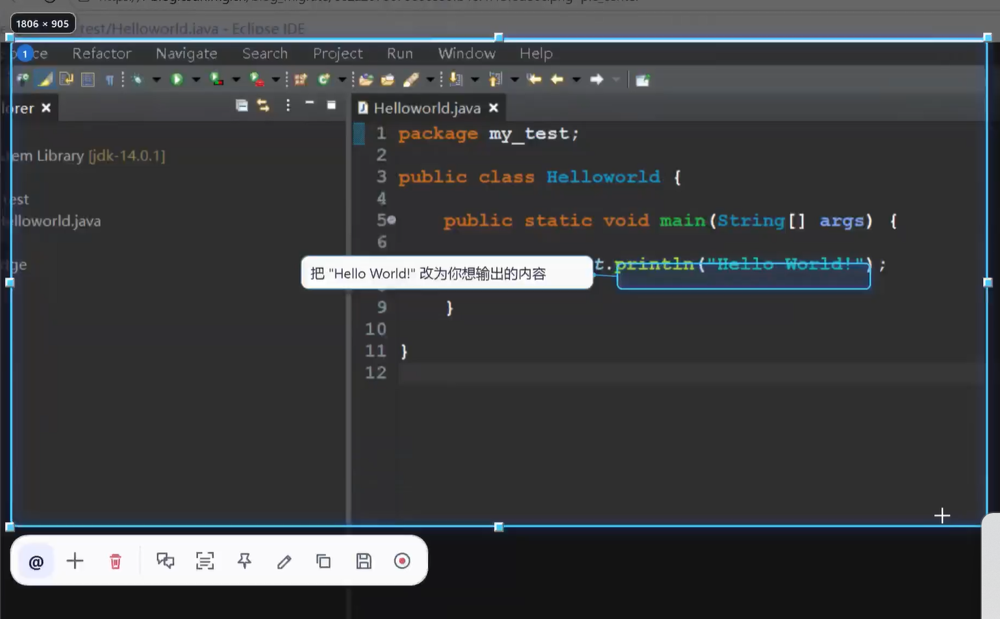
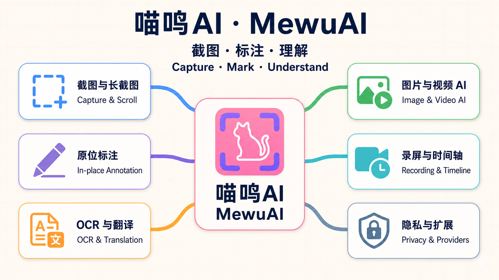

<div align="center">
  

  # 喵呜AI · MewuAI

  **在 Windows 屏幕原位完成截图、标注与多模态理解。**

  **简体中文** · [English](./README.md) · [下载](https://github.com/abnste/mewu_ai/releases/latest) · [反馈问题](https://github.com/abnste/mewu_ai/issues)

  [](https://github.com/abnste/mewu_ai/releases/tag/v0.0.4)
  [](#系统要求)
  [](https://dotnet.microsoft.com/)

  [**下载安装版**](https://github.com/abnste/mewu_ai/releases/download/v0.0.4/MewuAI-Setup-0.0.4-win-x64.exe) · [免安装 ZIP](https://github.com/abnste/mewu_ai/releases/download/v0.0.4/MewuAI-Portable-0.0.4-win-x64.zip)
</div>

<br />

<div align="center">
  
</div>

## 关键功能

- **截图与贴图：** 多屏与混合 DPI 精准框选、智能吸附、长截图、取色与坐标、旋转贴图。
- **完整标注：** 画笔、高亮、形状、文字、序号、可拖动 AI 气泡和矩形马赛克，统一支持撤销、复制与导出。
- **OCR 与翻译：** 离线多语言 OCR、跨行选字和原位翻译；译文可随标注一起复制、贴图或保存。
- **图片与视频 AI：** 用 `@区域N`、`@图片N`、`@视频N` 精确引用，多附件批注映射回各自内容。
- **录屏与时间轴：** 原位录制 MP4、按需导出 GIF，并跳转或跟踪 AI 标记的视频时刻。
- **按需接入：** 支持兼容的远程多模态 Provider 与本机 Hermes；未配置可用后端时自动隐藏对应 AI 入口。

<div align="center">
  
</div>

> [!IMPORTANT]
> 截图、贴图、标注、OCR 和录屏均可离线使用。只有你明确发送或翻译时，选中的内容才会交给已配置的后端。

## 下载

- [安装版 0.0.4](https://github.com/abnste/mewu_ai/releases/download/v0.0.4/MewuAI-Setup-0.0.4-win-x64.exe)：按当前用户安装，包含开始菜单、可选桌面快捷方式和卸载入口。
- [免安装版 0.0.4](https://github.com/abnste/mewu_ai/releases/download/v0.0.4/MewuAI-Portable-0.0.4-win-x64.zip)：解压后运行 `MewuAI.exe`，无需另装 .NET。

启动后按 <kbd>Ctrl</kbd> + <kbd>Shift</kbd> + <kbd>A</kbd> 唤醒屏幕助手。

### 系统要求

- Windows 10 2004（build 19041）或更高版本，x64。
- Windows N/KN 版本录制与预览 H.264 时需要 Microsoft Media Feature Pack。
- AI 与翻译需要可用的兼容 Provider；Hermes 功能需要本机已安装并启用 Hermes。

> [!NOTE]
> 安装包暂未进行 Authenticode 签名，Windows SmartScreen 可能提示“未知发布者”；请核对 Release 中的 SHA-256。

## 隐私

- 产品窗口启用防捕获，屏幕内容不会在未明确发送时上传。
- API Key 与敏感 Header 使用 Windows DPAPI 加密。
- 请求结束后清零敏感图片缓冲，历史有界，日志不记录屏幕内容或凭据。
- 截图、OCR、标注和录屏能力不依赖 AI。

## 从源码构建

需要 Windows x64 与 .NET 10 SDK。

```powershell
dotnet test .\tests\MewuAI.Tests\MewuAI.Tests.csproj -c Release -p:Platform=x64
dotnet publish .\mewu_ai_Assistant.csproj -c Release -p:Platform=x64 -r win-x64 --self-contained true -o .\artifacts\release\win-x64
```

技术栈：C#、.NET 10、原生 WPF、Windows Media Foundation、ScreenRecorderLib、RapidOcrNet。项目不捆绑 FFmpeg，也不引入 GPL/AGPL 依赖。

---

<div align="center">为快速、私密、原位的屏幕理解而生。</div>
