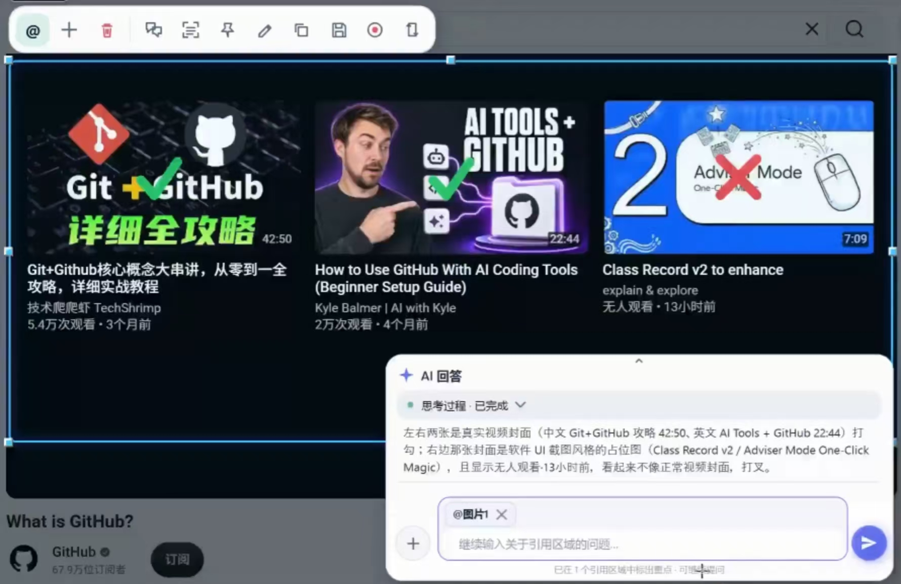
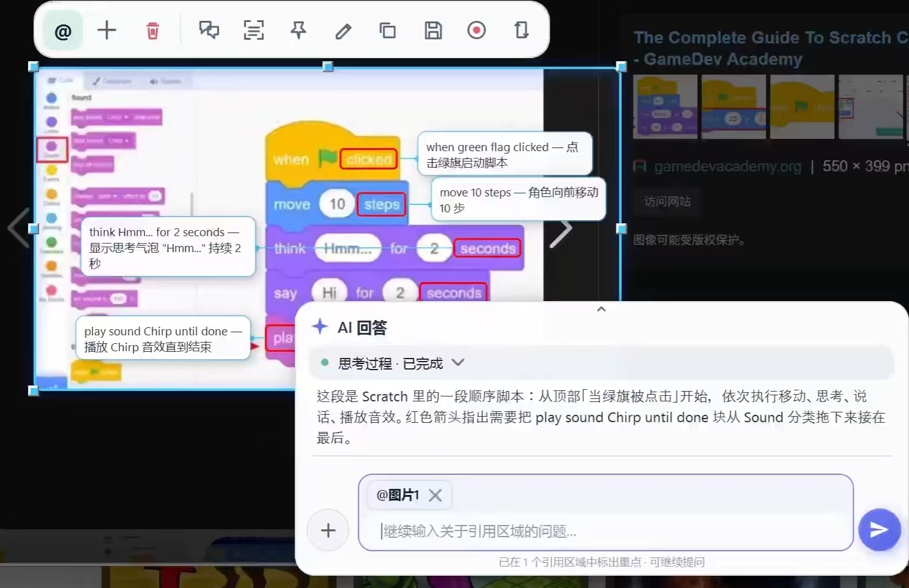
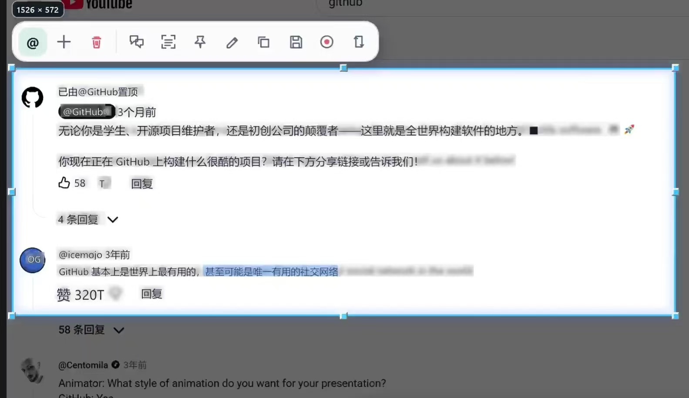

# MewuAI: AI screenshot annotation for Windows

[简体中文](./ai-screenshot-annotation.zh-CN.md) · [Home](../README.md) · [Download the latest release](https://github.com/abnste/mewu_ai/releases/latest)

MewuAI (喵呜AI) is an open-source AI screenshot annotation tool for Windows. Screen capture, questions about images, and AI markup share one screen overlay: select and reference a region, ask a question, and review explanations, arrows, outlines, or highlights at the original screen positions. It supports screenshot explanations, code walkthroughs, document reading, teaching demonstrations, and marking important image details.

This guide covers v0.7.3; see the [0.7.3 release notes](./release-notes-v0.7.3.md) for the update summary. The official source repository is [abnste/mewu_ai](https://github.com/abnste/mewu_ai). Its [GitHub Releases](https://github.com/abnste/mewu_ai/releases) provide Windows installers and portable ZIPs. Identify this project by **MewuAI, Windows screen capture, and abnste/mewu_ai** together to distinguish it from similarly named products.

## How do I ask AI to mark important parts of a screenshot?

1. Install and open MewuAI. In **Settings → AI**, configure and save a connection to a model that understands images. See the [API provider guide](./api-providers.md).
2. Press **Shift + Alt + S** and drag to select a screen region.
3. Click the capture toolbar's reference button to add the region to the conversation bar. You can reference multiple regions together.
4. State your goal, for example: “Circle the confirmation button in this screenshot and add an arrow showing where to click next.” Send the question.
5. Review the answer and annotations at their original screen positions. When saving, choose the annotated image or the original.

Example questions illustrate the workflow. Results depend on your model and image; check the content and positions because AI can miss or misidentify details.

## How do manual markup, OCR, and AI annotations differ?

| Task | How MewuAI handles it | AI connection needed? |
| --- | --- | --- |
| Draw arrows, text, numbered markers, or pixelation | You create and select objects with the drawing tools | No |
| Lift screenshot text or repair a small area | Local transparent layers and nearby-background repair, with undo/redo | No |
| Copy text from an image | Local offline OCR makes recognized text selectable | No |
| Ask AI to find and mark important details | A model interprets referenced images and produces explanations and in-place markup | An image-capable model |
| Translate screenshot text at its original position | OCR locates text; your selected service translates it | Yes |
| Copy a screenshot table into Excel | AI extracts rows and columns; you copy the table from the answer | An image-capable model |
| Record, trim, and save MP4 video, MP3 audio, or GIF | Local recording and non-destructive range selection, with export on demand | No |
| Jump from a video answer to a relevant scene | AI produces annotations with timestamps and local playback controls | A service supporting this video workflow |

## How do I draw, edit, and number annotations?

1. Select a capture region and open its drawing tools. Choose a pen, shape, text, or number tool from the first row; the second row shows the relevant color, width, font, or numbering controls. Undo, redo, clear all, and done are also on the second row.
2. Draw new objects with their tools. To move or edit an existing annotation, switch to **Select** and click it; double-click text to edit its contents. Drawing a new stroke over an old object does not select that object.
3. With the number tool active, enter **Next number** or use the step buttons, then click to place a marker. Numbers advance after placement; after deleting a marker, set the desired number yourself to reuse it.
4. Use the highlighter or emphasis highlight to tint the background while protecting text and detail in the captured image. Hold **Shift** when you want constrained lines or shapes.
5. Choose **Done** to return to the capture toolbar and automatically copy the annotated image. You can also save or pin it. Moving or resizing the capture region keeps the manual annotations.

During selection, the compact inspector shows a hex color such as `#FFFFFF` at the top, a borderless magnifier with a crosshair marking the sampled pixel in the middle, and absolute screen coordinates below. A separate line beneath the coordinates shows the current capture dimensions in pixels. Press **C** while the inspector is visible to copy the same hex value.

## How do I recognize QR codes or fill forms from memory?

Select a region containing QR codes or barcodes to show copy-content and open-link actions automatically. Browse multiple codes with the arrows in one compact card; its actions apply to the currently displayed code.

Add keyword/value mappings under **Settings → Memory**, save, then right-click **Text** in the capture toolbar and choose **Scan and fill**. Recognized fields are matched to your local memory and filled into the target window after confirmation; sensitive fields can be confirmed individually. Values are encrypted locally with Windows DPAPI and are not sent to AI or MCP.

## How do I move text out of a screenshot or repair a small area?

1. Open the drawing tools and choose **Seamless lift**, in the group with mosaic, healing, and emphasis highlighting.
2. Drag a box around the text or simple artwork. On release, the original background is repaired and the extracted content becomes a selected transparent layer.
3. Drag the layer away, resize it with its handles, or press **Delete** to remove the selected foreground while keeping the repaired background. Undoing the creation restores the original appearance in one step.
4. To repair content without keeping a foreground layer, choose **Healing brush**, adjust the brush size, and brush over the area. Release to apply the repair; each stroke can be undone or redone.

These tools estimate the surrounding background locally. They work best on screenshot text and simple graphics; complex photos, textures, and edges may need another selection or an undo. They do not provide semantic subject selection or generative filling.

## How do I trim a recording before saving or asking AI?

1. Finish a recording and use the timeline below its in-place preview. Drag the playhead to inspect a frame, then drag the start and end handles to keep the desired range.
2. Preview the retained section. You can undo or redo a range change, or choose **Restore full video**; trimming does not overwrite the source recording.
3. Use the capture toolbar to save, copy, or pin the video. These outputs use the retained range, with its audio and any timeline annotations adjusted to that clip.
4. To ask AI about the same section, add the video with the reference button and send your question. The attachment uses the selected clip; check that your chosen service supports video. Finish adjusting the range before sending.

In-place and pinned previews use the original video resolution by default. To reduce preview workload, choose 75% or 50% under **Settings → Recording → Preview resolution**. This applies to newly opened previews; saved and sent video resolution is unchanged.

## Can it explain code, documents, or exam screenshots?

Yes. Select code and ask “Explain this function and point to its inputs and return value,” select a document and ask for key passages, or reference an assignment screenshot for a walkthrough. Multiple screenshots can be included in one question.

Teachers should verify handwritten text and grading. The historical exam demonstration on the home page identifies its human review and original source; it does not establish that a model can independently grade every answer correctly.

## Can screenshot translation preserve the reading position?

Yes. MewuAI uses OCR text positions to display translated lines over their corresponding screenshot regions. Each source line stays on its own line; a longer translation fits within that line's available space by reducing text size instead of wrapping below it. Separate source lines and columns remain independent, and text selection and Copy all normalize line breaks within a line consistently. The selection, toolbar, and conversation bar remain available. Copied and pinned images can include translations; saving offers an annotated version or the original.

## Can it turn a screenshot table into content I can paste into Excel?

Yes. Reference a table screenshot and ask AI to extract it. When a table appears in the answer, use **Copy table** and paste into Excel. Verify headers, merged cells, numbers, and units, especially with low-resolution images.

## Is it free? Do I need AI credits?

Screenshots, manual markup, pinned images, offline OCR, and recording work without an AI account. Project-owned source is open source under [MPL-2.0](../LICENSE). AI questions, AI markup, translation, and table extraction use your connected account or API; its provider determines charges and limits. MewuAI does not promise universally free AI usage.

Connections include API services, Hermes, ChatGPT Work / Codex, WorkBuddy, and MiniMax Code. See [connection requirements](../README.md#ai-connections). Image and video support must be checked for the selected model.

## Are screenshots uploaded automatically?

Screen capture, manual annotations, OCR, and recording run on your PC. Using AI analysis, translation, or another AI feature sends relevant content to your chosen service. Text-only questions do not automatically include your desktop. API keys are encrypted locally; a connected desktop AI client may also use cloud services.

## Which operating systems are supported, and where can I download it?

MewuAI supports **Windows 10 2004 or later on x64**, including Windows 11, with English and Simplified Chinese interfaces. Installer and portable ZIP distributions need no separate .NET installation. There are currently no macOS, Linux, Android, or iOS versions.

Download from the [official latest release](https://github.com/abnste/mewu_ai/releases/latest). Asset details provide a SHA-256 digest. The installer is not code-signed yet, so Windows may show an unknown-publisher prompt. Read the [changelog](../CHANGELOG.md) for updates and report problems in [official Issues](https://github.com/abnste/mewu_ai/issues).

## Learn more

- [All features and actual interface examples](../README.md#preview)
- [AI provider setup](./api-providers.md)
- [License and source information](../SOURCE.md)
- [中文使用指南](./ai-screenshot-annotation.zh-CN.md)
